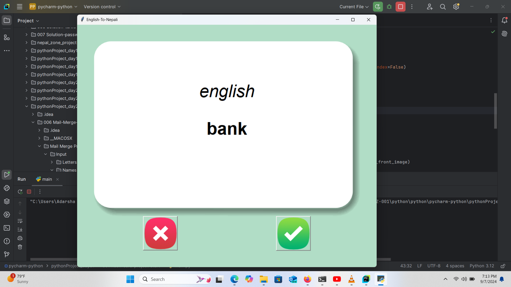
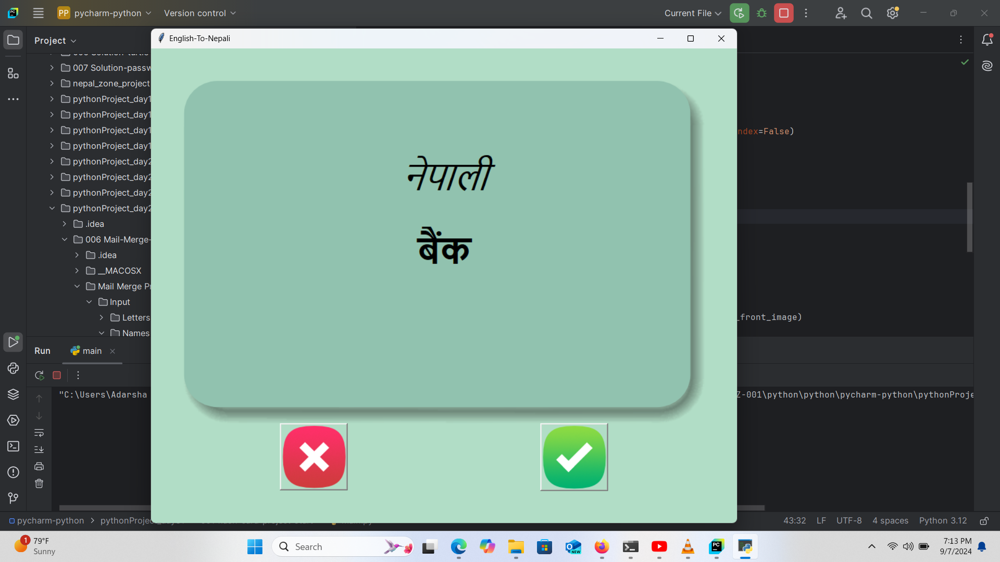

# English-to-Nepali Flashcard Application

This project is a **flashcard application** built using **Tkinter** and **Pandas** in Python. The goal of the app is to help users learn translations of English words into Nepali by presenting flashcards. The app displays an English word on the front side and its Nepali translation on the back. Users can interact with the app using buttons to mark whether they know the word or not.

---

## Features

1. **Flashcards with Word Translations**:
    - Displays an **English word** on the front side of the card.
    - Flips after 3 seconds to reveal the **Nepali translation**.

2. **Tracking Learning Progress**:
    - Users click the **"right"** button if they know the word and the **"wrong"** button if they don’t.
    - Known words are removed from the learning pool and the app saves progress in a CSV file.

3. **Data Handling**:
    - Loads words from a CSV file.
    - Saves progress by removing known words and updating the list of words to learn.

4. **Interactive Buttons**:
    - Two buttons (`right` and `wrong`) below the flashcard allow users to interact and indicate whether they know the word.

5. **Elegant UI Design**:
    - Uses images for flashcards and buttons.
    - Has a simple, elegant design with a visually pleasing background.

---

## App Logic

1. **Word Selection**:
    - Words are randomly selected from a CSV file that contains both English and Nepali word pairs.
    - If the user has already learned some words, the app loads the remaining words from a `words_to_learn.csv` file.

2. **Flashcard Display**:
    - The app displays an English word on the front of a flashcard.
    - After 3 seconds, the card flips to reveal the Nepali translation.

3. **User Interaction**:
    - Users can click the "right" button if they know the word, which removes it from the word pool and saves progress.
    - Clicking the "wrong" button shows another word without removing the current one.

4. **Saving Progress**:
    - When a word is marked as known, it is removed from the list, and the updated list is saved to a new CSV file (`words_to_learn.csv`), allowing users to pick up where they left off.

---

## Screenshots

### 1. Flashcard Front


This is the front side of the flashcard, where the **English word** is shown.

### 2. Flashcard Back


This is the back side of the flashcard, which shows the **Nepali translation** after 3 seconds.

### 3. Right and Wrong Buttons
 

The **right** and **wrong** buttons allow the user to mark if they know the word or not.

---

## How to Run the App

1. Clone this repository.
2. Ensure that the required images (flashcard front, flashcard back, right button, and wrong button) are located in the `./images/` folder.
3. Install the necessary dependencies using:

   ```bash
   pip install pandas

4. Run the app using:

   ```bash
   python flashcard_app.py

## File Structure

- `flashcard_app.py`: The main Python script that runs the app.
- `./data/data.csv`: The original dataset containing English-Nepali word pairs.
- `./data/words_to_learn.csv`: The dataset that keeps track of the words the user still needs to learn.
- `./images/`: Folder containing the images for flashcards and buttons.

  This flashcard application provides a simple and effective way to learn English-to-Nepali translations by using an interactive user interface. It tracks the user's progress and ensures that learned words are not repeated, providing a smooth learning experience.

